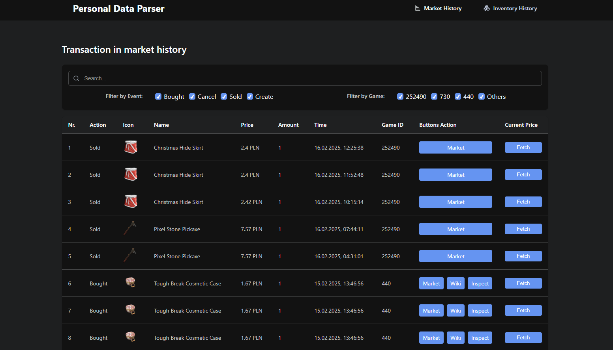
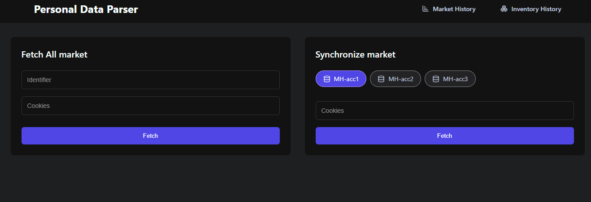

# Market history data parser

Simple full-stack application (react, fastify, mongodb) to parse and store market history personal data from steam market. It allows to filter, search and display data without waiting for steam to load it.

## Preview

### Market history dashboard



### Fetching home page



## Installation

1. Clone the repository

```bash
git clone  https://github.com/Piootrekk/steam-personal-data-parser.git
```

2. Run docker-compose

```bash
docker-compose --env-file .env.docker up --build
```

## Configuration

To fetch personal history from steam market you need to provide cookies (steamLoginSecure, sessionid) - provide them in input fields on home page.

```bash
steamLoginSecure=your_steamLoginSecure; sessionid=your_session_id;
```

## Additional information

This application is supposed to be used locally, is not hosted anywhere. It is not recommended to host it online, don't risk leaking your steamLoginSecure and sessionid.

## License

[MIT](./LICENSE)
